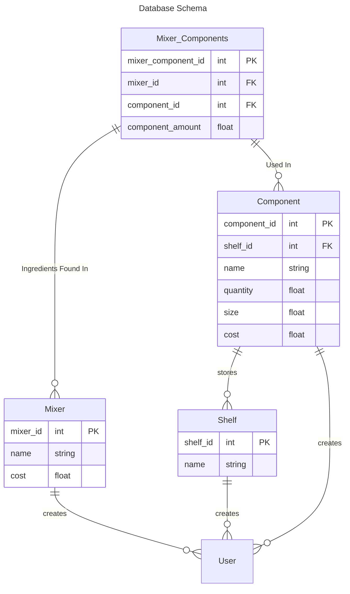

# Schema for the Project Database

---

```mermaid
---
title: Database Schema
---
erDiagram
Mixer_Components ||--o{Component: "Used In"
Mixer_Components ||--o{Mixer: "Ingredients Found In"
Component ||--o{Shelf : "stores"
Mixer ||--o{User : "creates"
Shelf ||--o{User : "creates"
Component ||--o{ User : "creates"

User {}

Component {
    component_id int PK
    shelf_id int FK
    name string
    quantity float
    size float
    cost float
}

Shelf {
    shelf_id int PK
    name string
}

Mixer {
    mixer_id int PK
    name string
    cost float
}

Mixer_Components {
    mixer_component_id int PK
    mixer_id int FK
    component_id int FK
    component_amount float
}


```
