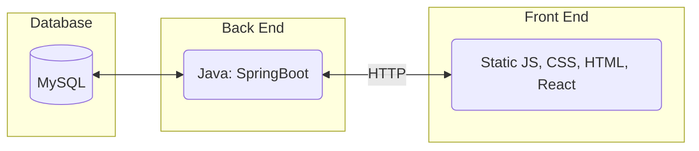

# Home Bar Inventory

---

## Purpose:

While many applications exist to manage food and drink inventories for restaurants,
not many of these are available to the average household for free.
The goal for this project was to create a solution to this problem, in which a user
is able to store the inventory of drinks they may have at home and update it as things
are used up.

This project is at its core a Java API used to manage the inventory of an at home bar.
Completing this project will demonstrate my ability to create and use a REST API while 
following procedures and practices used by proper software engineers.

---

## Key Features:

* Add, Remove, and Update Drink Components (Spirits, Mixers,etc.)

* Save commonly made mixed drinks to repeatedly remove specific amounts
of the components that make up the drink

* Detail what is purchases are needed to bring the bar back to set "in-stock" quantities
 

* Find out the cost per unit of a given mixed drink based upon costs of components used in it

---

## Procedure Used:

One of the goals of this project is to demonstrate my knowledge of proper software engineering procedure. 
In order to show this, I am ensuring to maintain my code using the following procedures:

* Create issues within GitHub to represent tasks that need to be completed within the project

* Create feature branches and use merge/pull requests to merge them into the main branch
 

* Assess time taken to complete a task and assign it story points after the fact in the MR 
(While this traditionally would be done in Sprint planning, this project is being carried out alone)

* Maintaining proper documentation in the form of assorted markdown files and proper MR descriptions

* Testing code in the form of JUnit Tests and manual Postman tests

---

## Technology Stack Used:

